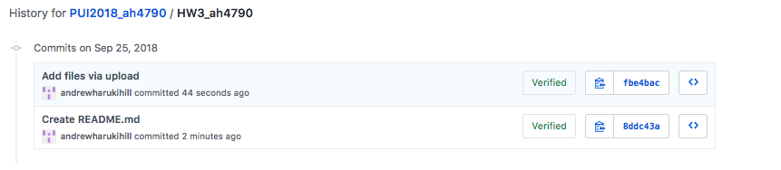
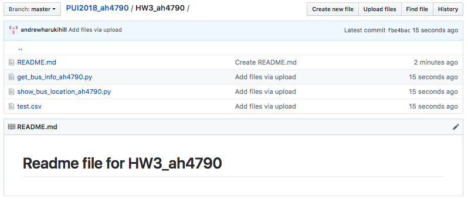

# Readme file for HW3_ah4790

# Scope of the Homework
* For the first assignment, I created a .csv file in this github repository, pulled the file locally, and then deleted it and any trace of it from both my local directory and from github
* For the second assignment, I downloaded a .csv file containing trash data from the NYC Department of Sanitation into a Pandas dataframe. I first rendered the first seven rows of the dataframe and then pared it down to two numerical columns and rendered the first seven rows again. After rendering, I then created a scatterplot of those two columns.
* For the third assignment, I pulled real-time data from the MTA Bus API and, through a python script, wrote code to display the latitude and longitude of the buses on a user-determined line.
* For the final assignment, I again pulled real-time bus data. But instead of displaying just the latitude and longitude of the buses, the code wrote a .csv file that contained that data along with what stop each bus was closest to and how far away it was from that stop.

## Screenshots for Assignment 1

## Acknowledgements: 
### I collaborated with Nathan Caplan and Eve Marenghi on Assignments 3. On Assignment 4, Nathan and I co-wrote the function to write the data to a .csv file
